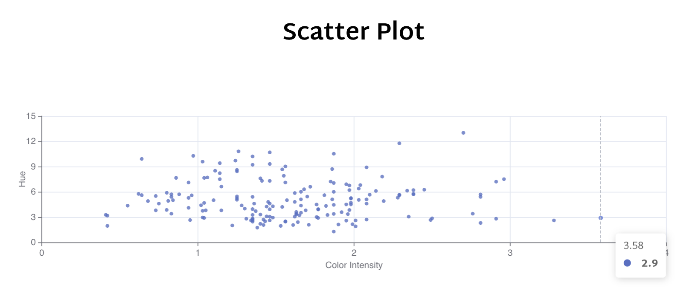
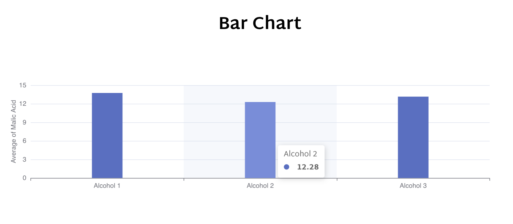

# manufac-assessment
This project takes a json data and provides two graphs i.e, Scatter Plot and Bar Chat, which you can navigate through navigation bar. This is a single-page website built-in TypeScript in React.  

To run the project :  
`cd manufac-assessment` 
`yarn && yarn start`

The following graphs should be visible after running the project.
## Scatter Plot Graph

## Bar Chart Graph

